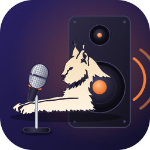

# Lynx DeFeedback Host
## Disclaimer:
This project is in no way affiliated with Alpha Labs LLC. It just uses their DeFeedback Audio Unit that they created and uses their logo for visual identification purposes only. 
## Purpose:
[Alpha Labs](https://www.alphalabsaudio.com/) has created a fantastic audio plugin to fight feedback in live sound situations for vocals. I plan on integrating a Mac Mini in my audio rig to run this plugin as well as other things. This computer will run headless without any screen or input devices, however. As a result of this decision I need a way to control the plugin or see the current state of the plugin's settings.   There are DAWs and plugin hosts that are controllable via mdi or OSC, but that doesnt get me a good picture of the current settings, nor does it let me add/modify the configuration.  So this application was born.  Its sole purpose is to run a low-profile, fast AudioUnit host just to run the DeFeedback plugin while giving me ways to adjust settings and instances using other means.  Currently it starts up a web host that can be used to change settings as well as control the plugin host, such as specify which audio device to use, how many instances are running, or which channels to use for input or output for each instance. The host also contains an [Elgato Stream Deck](https://www.elgato.com/us/en/s/explore-stream-deck) plugin that can be installed. It can be used to perform common tasks such as muting/bypassing an instance, or changing the strength parameter for the plugin.
## Requirements:
This app does NOT provide the de-feedback functionality itself.  It requires you to install AlphaLabs [De-Feedabck](https://www.alphalabsaudio.com/defeedback/) audio unit and have your own licence for it.
MacOS 27 or newer required due to usage of the new AVFAudio library function [withAudioUnit](https://developer.apple.com/documentation/avfaudio/avaudiounit/withaudiounit(_:\)-66uo7) that gives thread-safe access to the underlying audio unit.
iPad version is not currently possible as iOS requires AUv3 audio units and AlphaLabs has not provided one. As soon as an AUv3 version is available, I do plan on trying to adapt this application to iOS.

## Usage:
### The Application:
The application itself is fairly self-explanatory if you are familiar with audio processing.  The input and output devices, the buffer size, and the sample rate cannot be changed while the host is running.  The input and output devices must be operating at the same sample rate for the host to be enabled.  Instance can be created and deleted at any time, even while running.  Their input and output channels also can be changed live.  Settings pages allow for defining startup behavior (auto-start),  turning on/off the web server, configure auth settings for the web server, and installing the streamdeck plugin.
### The Web Host:
\*\*\* IMPORTANT \*\*\* : The web host is NOT a secured connection.  It uses simple HTTP Authentication headers if enabled, and is NOT encrypted.  Any decent malicious attacker could easily bypass the authentication and cause chaos.  DO NOT USE ON AN OPEN NETWORK!!!   Same rules for changing values as the application apply.   Settings pages are not accessible.
### The Stream Deck:
The Web Host MUST be active for stream deck support to work. 
Plugin-level settings are shared between all actions.  Changing values in one action changes them in all other actions.
- hostname: usually localhost if running on the same machine as the host application.  hostname or IP address on the machine. 
- port: the port the web server is running on, defaults to 8787
- username: if authentication is required, the specified username
- password: if authentication is required, the specified password

Currently three key actions are supported:
- Mute - mutes a specified plugin instance on the host
  - Settings:
    - InstanceName: the name of the instance to mute/unmute.
  - States:
    - 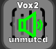 Unmuted
    -  Muted
- Bypass - bypasses the specified plugin instance just passing the input straight to the output.
  - Settings:
    - InstanceName: the name of the instance to bypass.
  - States:
    - 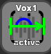 Active
    - 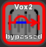 Bypassed
- Strength - Changes the strength parameter for the specified plugin instance to the desired value
  - Settings:
    - InstanceName: the name of the instance to set the strength value
    - Strength: the value that the plugin's strength parameter should be set.
  - States:
    -  Strength parameter matches the value for this action
    -  Strength parameter does not match the value for this action
    - 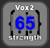 Plugin is bypassed
    - 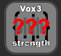 Error state: invalid strength value in action settings

Future planned actions is a encoder to set strength (rotary knob).

Plugin Error states:
- Cannot contact host. Check that host is running, web server is active and can be reached, and authentication settings are correct.
  - Example images  
    -  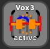  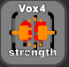
- Host is stopped.  Verify that the host's audio engine is running.
    - Example images  
      - 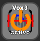  
- Invalid instance name.  Verify that the action's Instance Name references a valid instance in the host.
    - Example images  
      -  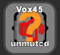 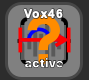

## Donations Accepted:
As I am currently an unemployed software engineer I have not been able to afford buying a license to the DeFeedback Plugin.  All testing has been performed using the trial version.    If you find this project useful or at least promising, I do encourage you to donate!  Donations will be used to first purchase three copies of the DeFeedback plugin, one for my main development box, the others for my live sound rig for active usage/testing of this app, as well as a backup for my laptop, because any live sound engineer needs a backup for anything critical.  After that has been achieved, further donations will go to upgrading my live sound gear that this plugin directly interfaces with such as a new mixer and dante interfaces.
So if you wish to donate, click on the '[Sponsor](https://github.com/sponsors/eklynx)' button above!

## Future Features:
- Stream Deck encoder support - High priority. Med complexity.  The encoder can let you scroll through strength percentages instead of having pre-set buttons.  I want to make sure it doesnt spam the web server so it should wait a little (100ms?) after the last change to the encoder before sending the updated value to the host.  I also need to figure out a good way to actual display the value and instance.
- Launch agent to keep the service running - High priority, med complexity.  I would want a launch agent service that just monitors if the application is still running, and starts it back up if it has crashed (but also obeying restart/shutdown signals for the system).  Or I could have a daemon mode for the service so it just runs as a service without the UI, and the UI would just be control of the background service. This is the final step for the full headless setup.
- I/O Recording - Med priority, Med-high complexity.  If weirdness happens through the plugin, it might be nice to have the before and after audio files to try to recreate the issue.  If i can implement recording of the input and output signals without sacrificing efficiency, this would be a good feature to add.
- Stereo support - Low Priority. Low Complexity. All my personal use cases are mono channels.  Need to ask Alpha Labs if the stereo channels actually learn with each other, or are completely separate processing anyway.  If separate, this can lower instances.
- Localization - Low Priority, Med Complexity. Add support for other languages. Started framework with error messages. 
## AI usage note:
AI was used to assist in creating this application.  That being said, AI was used as a tool, not a decision maker.   ***All*** code created by AI was analyzed by a human to validate behavior and to facilitate learning how the libraries used.  Application's functional layout was designed by a human. Almost all of the unit tests were generated by AI.  All were reviewed by a human (me) for validity, and code modified by hand where behavior was not as expected.  This is done to help avoid confirmation bias by the developer (me) solely designing their own tests.  I am also not a UI designer, so I have relied on AI to generate a functional Swift and Web UI using guidelines I specified.  If the AI generated code i did not understand the purpose, I asked it for clarification on why and either kept or modified the code myself to suit my needs. Comments added in code where AI was used.
## Legal:
I provide this as-is.  I cannot guarantee this does not blow up your system.  I am just making my best attempt at a useful tool to share to the world.  Use at your own risk!
Also, once again, this project is in no way affiliated with Alpha Labs LLC. It just uses the DeFeedback Audio unit that they created and uses their logo for identification purposes only.  
